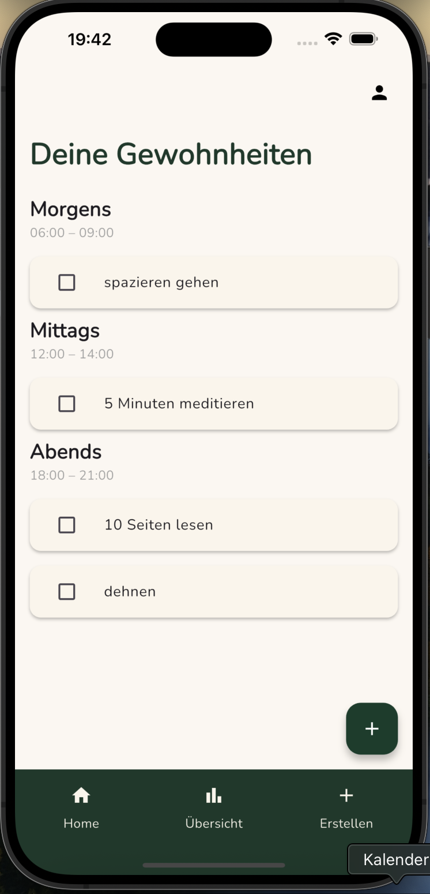
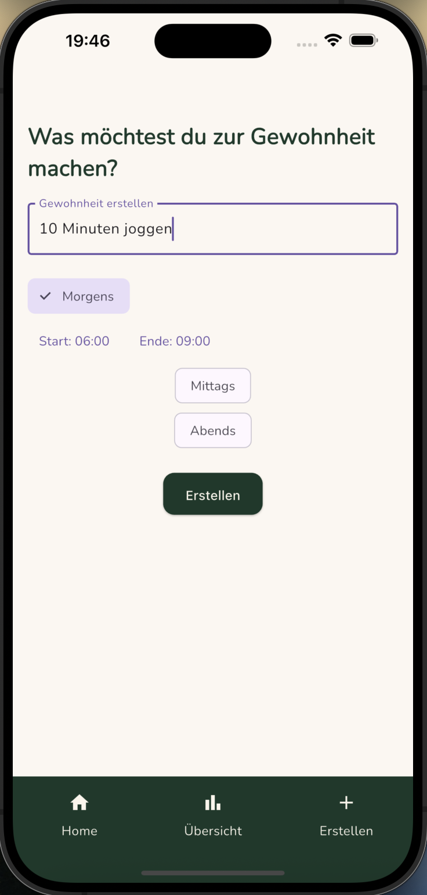
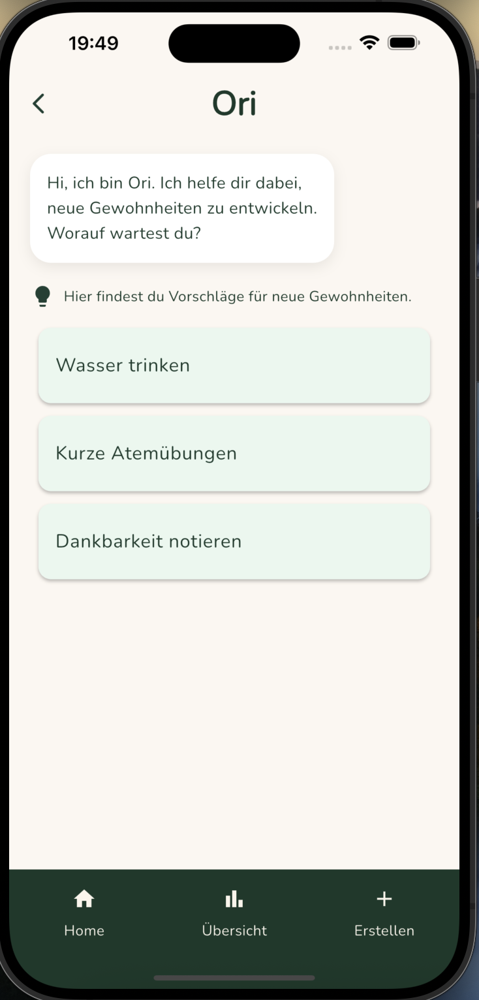

# 🌱 Habit-O – A Habit Tracking App

[](https://flutter.dev)
[](#)
[](#)
[](https://firebase.google.com/)

**From zero to hero – step by step toward a better version of yourself.**  
Habit-O helps you build new routines — with structure, motivation, and clarity, but without pressure.

---

## 🧩 The Problem Habit-O Solves

Many people want to establish new habits — whether it's more exercise, better sleep, or self-care.  
But when daily life gets busy or motivation fades, they often fall off track.

**Habit-O helps you by offering:**

- 🆕 Intuitive habit creation
- 🤖 AI-based habit suggestions via *Ori*
- 📊 Visual long-term progress overview *(planned)*

---

## 👤 Who Is Habit-O For?

### 🎓 Persona: Annika, 19, second-semester student

Annika recently moved out and wants more structure in her daily life.  
She has lots of ideas for self-improvement but struggles to follow through.

**She wants:**

- clarity about her goals
- to feel proud of herself
- routines that fit her student lifestyle

**But she struggles with:**

- self-doubt and perfectionism
- overwhelming goals that are hard to start
- lack of insight into how consistent she really is

**Habit-O** is her small everyday coach — no pressure, but a clear plan.

---

### 👩‍👧 Persona: Maria, 35, working mother

Maria has two kids and a part-time job, making her days very full.  
She wants to add personal habits like daily reading or meditation, but often loses track in everyday chaos.

**She wants:**

- more balance between responsibilities and self-care
- to be a strong role model for her daughter
- to use short free-time windows meaningfully

**But she struggles with:**

- spontaneous moments that go to waste
- guilt when taking time for herself
- routines that don’t match her hectic day

**Habit-O** helps her stay on track with simple steps and clear structure.

---

## 🖼 Screens

| Screen                           | Description                                                             |
|----------------------------------|-------------------------------------------------------------------------|
| 🏠 **Home Screen**               | Displays today’s habits grouped by time of day (morning, noon, evening) |
| ➕ **Create Habit**               | Create new habits with title and preferred time of day                  |
| 🤖 **Ori Chat**                  | AI suggests new habits                                                  |
| 📊 **Progress View** *(planned)* | Calendar view with green-highlighted completed days                     |

### 📸 Screenshots

<p align="center">
  
  
</p>
<p align="center">
  
  
</p>

---

## 🚀 Features

- ✅ **Create and manage new habits**
- ⏰ **Time-based grouping (morning, noon, evening)**
- ✅ **Delete habits**
- 📤 **Store habits persistently in Firestore**
- 🤖 **Receive AI-generated habit suggestions with Ori**
- 📅 **Track progress over time** *(feature incomplete)*

---

## 🤖 AI Feature "Ori" – External Backend

The **Ori** feature provides personalized ideas for new habits the user hasn't already listed.  
It acts as a creative boost — especially when you're stuck.

### ⚙️ How it works

- The app sends a list of existing habits to the **Ori backend**
- This backend is a **Java Quarkus application**, connected to **GPT-4o** via OpenAI
- GPT-4o analyzes the input and generates meaningful, **non-redundant** suggestions
- The response is a list of new, personalized habit ideas

### 🧰 Technology Stack

| Component     | Description                                   |
|---------------|-----------------------------------------------|
| **Backend**   | Java with [Quarkus](https://quarkus.io/)      |
| **API Layer** | REST via Jakarta WS (`@Path`, `@POST`)        |
| **AI Model**  | GPT-4o by OpenAI                              |
| **Hosting**   | Deployed via Goggle Cloud Run                 |
| **Endpoint**  | `POST /chat/habits` — receives & returns JSON |

---

## 📂 Project Structure

The app follows the **Layer-First Architecture**, meaning all code is organized by responsibility:  
logic, UI, data models, storage and external services are clearly separated.

### 📁 Folder Overview

```bash
lib/
│
├── bloc/                   # State management per feature
│   ├── auth/
│   ├── habit/
│   ├── habit_time_range/
│   └── user/
│
├── constants/              # Central color, text, and style definitions
├── interfaces/             # Abstract contracts for services and repositories
├── models/                 # Data models (Habit, TimeRange, etc.)
├── repository/             # repositories
├── router/                 # Navigation with GoRouter
├── services/               # Authentication and Ori AI logic
├── validators/             # Input validation logic
├── views/                  # Screens: home, create, login, profile, etc.
├── widgets/                # Reusable UI components
├── firebase_options.dart   # Firebase configuration
└── main.dart               # App entry point

---
## 🧰 Tech Stack

| Layer      | Tools & Libraries                                 |
|------------|---------------------------------------------------|
| Frontend   | Flutter 3.29.3, Dart 3.7.2                        |
| State Mgmt | Bloc, flutter_bloc                                |
| Backend    | Firebase Auth, Firestore Firebase                 |
| Extras     | SharedPreferences für Intro-Tracking              |


---

## 🛠 Installation

##   Prerequisites

- 🐦 **Flutter SDK** >= 3.7.2  
- 💻 A development environment such as IntelliJ IDEA

### Run locally


git clone https://github.com/batooch/HabitO.git
cd habito
flutter pub get
flutter run

---

#### 👩‍💻 Developed and designed with passion by:

- [@batooch](https://github.com/batooch)

> 💬 Feel free to reach out for questions, feedback, or collaboration ideas! 🤝🚀
---